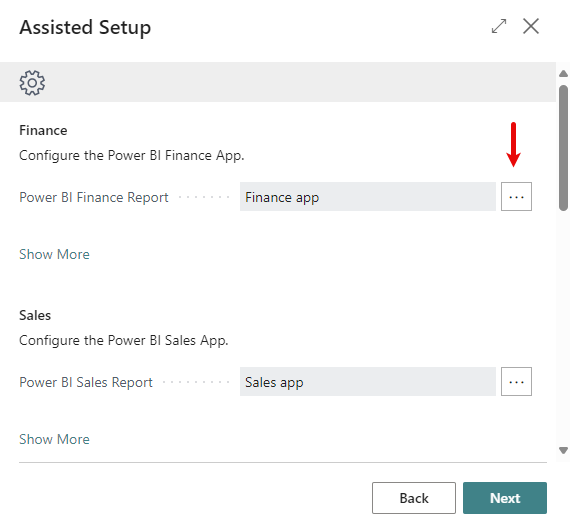
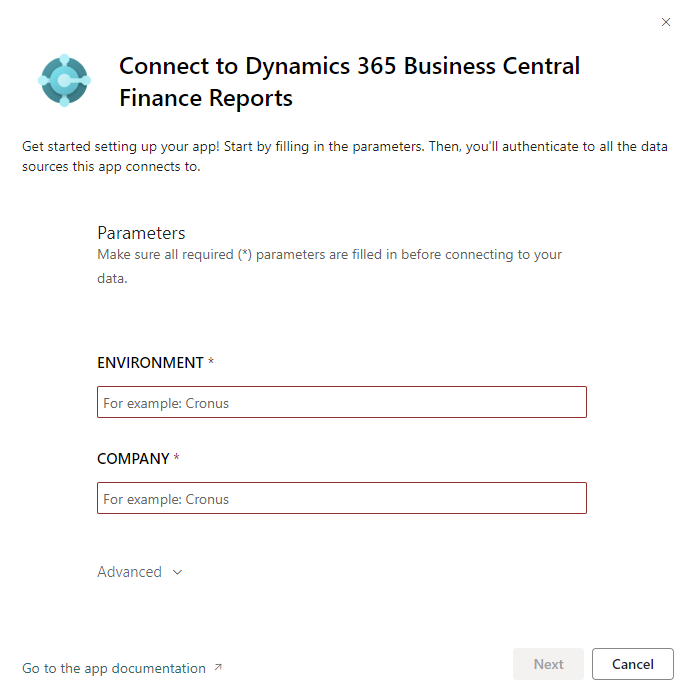
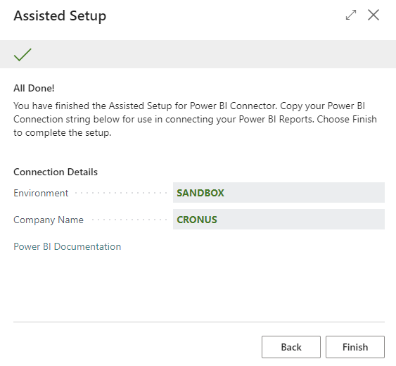

<!-- TODO: 
Replace
Power BI
with 
[!INCLUDE [powerbi-name](includes/powerbi-name.md)]

Replace
Power BI PRO
with 
[!INCLUDE [powerbi-pro](includes/powerbi-pro-license-name.md)]

Replace
Business Central
with 
[!INCLUDE [prod_short](includes/prod_short.md)] 

--->

# Configure the Power BI app for Business Central

[!INCLUDE[applies-to-2024w2](includes/applies-to-2024w2.md)]

In this article, you will learn how to configure the Power BI app for use with the embedded Power BI reports in Business Central. 

> [!NOTE]
> This configuration can be managed by stepping through the **Connect to Power BI** assisted setup guide, or by navigating to the **[Power BI Connector Setup](https://businesscentral.dynamics.com?page=36951)** page.

<!-- TODO: replace with 
[!INCLUDE [preview](includes/preview.md)] 
-->
Configure the following components:
1. Calendar Type 
1. UTC Offset
1. Date Table Range
1. Working Days
1. Report Mapping
1. Connection Details

## Calendar Type Configuration
Choose which type of calendar the year boundaries are applied to. 
- **Fiscal**: 12-month calendar that begins in any month of the year and ends twelve months after.
- **Standard**: 12-month calendar that begins on January 1 and ends on December 31.
- **Weekly**: Calendar that supports: 445, 454, or 544 week groupings. The first and last day of the year might not correspond to a first and last day of a month, respectively.

> [!IMPORTANT]
> By default, all Power BI reports are configured to use Fiscal Calendar date fields and Fiscal Time Intelligence measures. If you choose a calendar type other than Fiscal, you will need to edit the Power BI reports and change the date field references and measure references accordingly. 

## UTC Offset
Defines the UTC time zone in the Power BI date table.

The UTC Offset allows your Power BI semantic model to accurately calculate what the current day is in respect to your geographical location. This is necessary because Microsoft’s servers may be hosting your Power BI Service from a data center located in a different region.

UTC offsets are based on Business Central time zones.

## Date Table Range
The Starting Date and Ending Date fields are set automatically based on your Business Central Accounting Periods. Based on these dates, Power BI will generate a series of continuous dates for your date table. 
> [!NOTE]
> If you have Budgets that extend past the last date in your Account Period table, you will need to manually set the Ending Date to accommodate the extended range.

## Working Days
Set days of the week you consider "working days". The default setting is Monday to Friday.

## Embedded Report Mapping
Link the Power BI apps in your Power BI service with Business Central's embedded report pages:

1. For each report select the ellipsis to open the **Select Power BI Workspace** page.
1. Select the corresponding workspace where the report app is stored.
1. Select the Power BI Report you wish to link.

## Connection Details
This portion of the configuration must be executed against the semantic models in your [Power BI service](https://app.powerbi.com). 

The semantic models require two parameters to be populated:
- ENVIRONMENT
- COMPANY

The values for each can be found in the connection details of the assisted setup guide or on the **[Power BI Connector Setup](https://businesscentral.dynamics.com?page=36951)** page.

